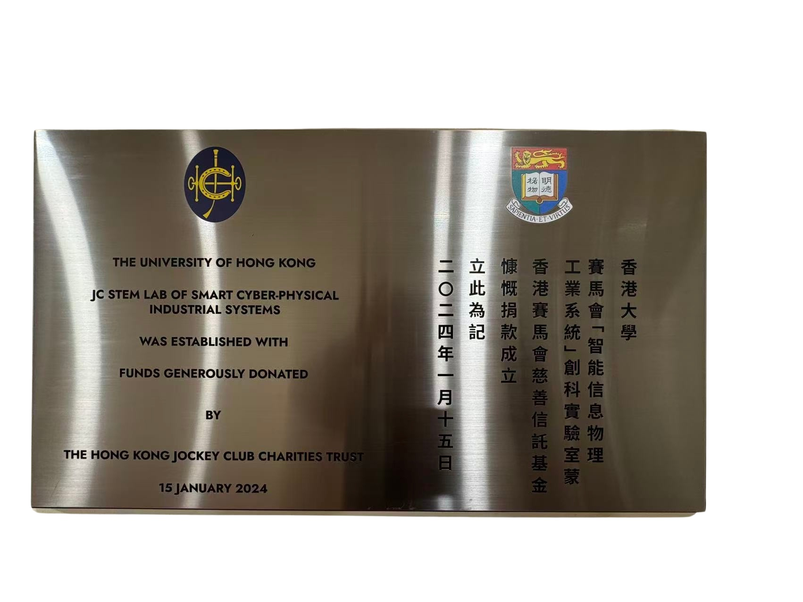
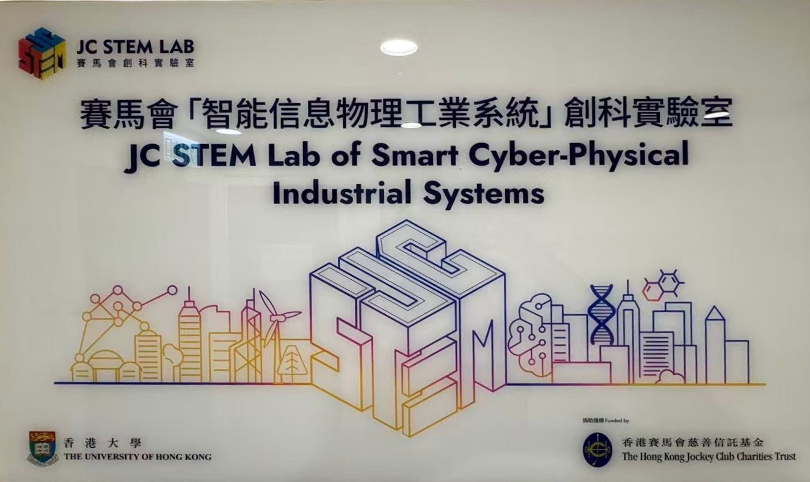

---
---

Welcome to JC STEM Lab of Smart Cyber-Physical Industrial Systems at The University of Hong Kong! Our research explores deep integration and interaction between cyber systems and physical systems to tackle practical challenges, leveraging the state-of-the-art robotic systems such as humanoid, quadruped robots, robotic arms, hexapods, and automated vehicles. Highly motivated students interested in our research are encouraged to contact us. See our [projects](/projects/) and [research](/research/) for more details. Please visit our [contact](/contact/) page to get in touch.

  
  



## Highlights



Our research focuses on cyber-physical systems and robotics. We work on cutting-edge technologies to bridge the gap between digital computation and physical processes.









We develop innovative solutions in robotics and automation. Our projects leverage advanced robotic platforms to solve real-world challenges in industrial environments.









Our lab brings together talented researchers and students passionate about robotics and cyber-physical systems. Join us to explore the future of intelligent systems.






